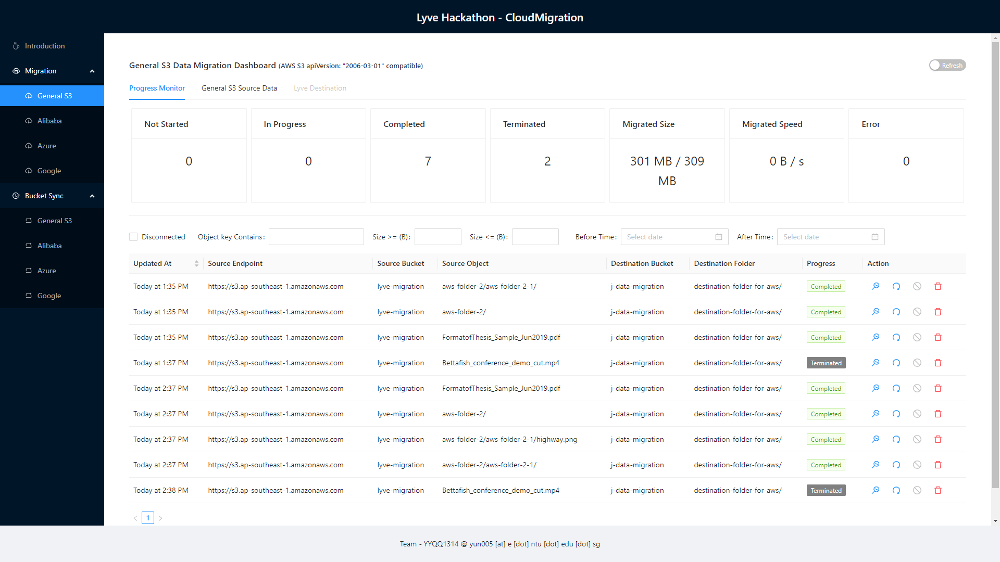
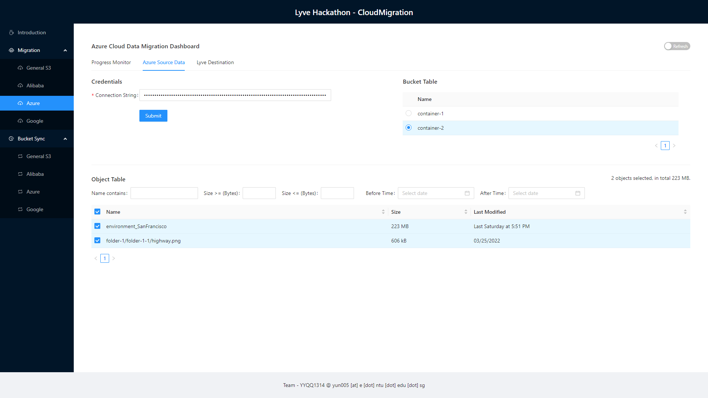
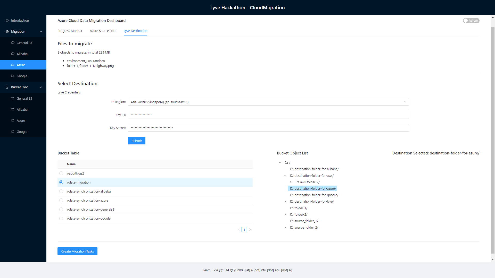
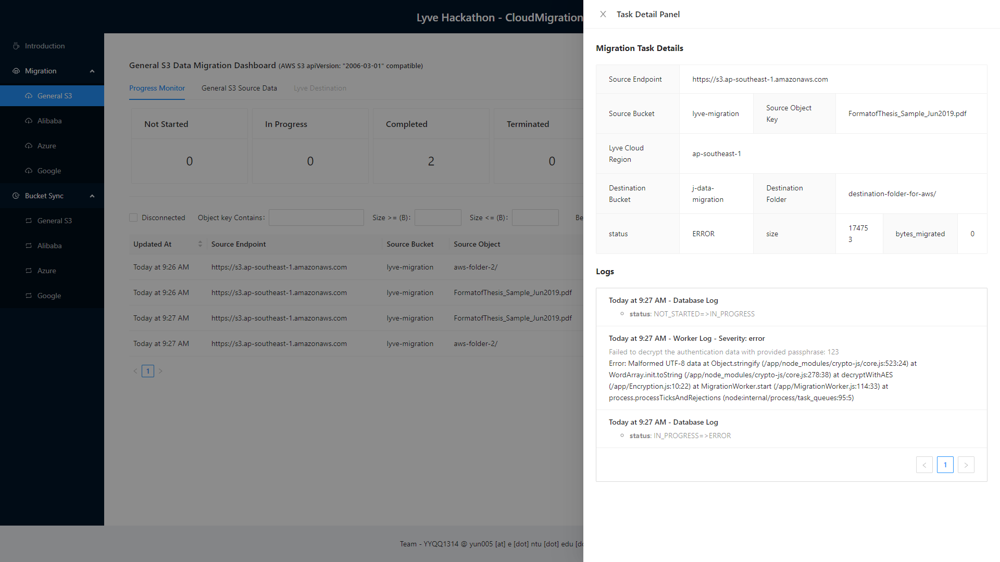
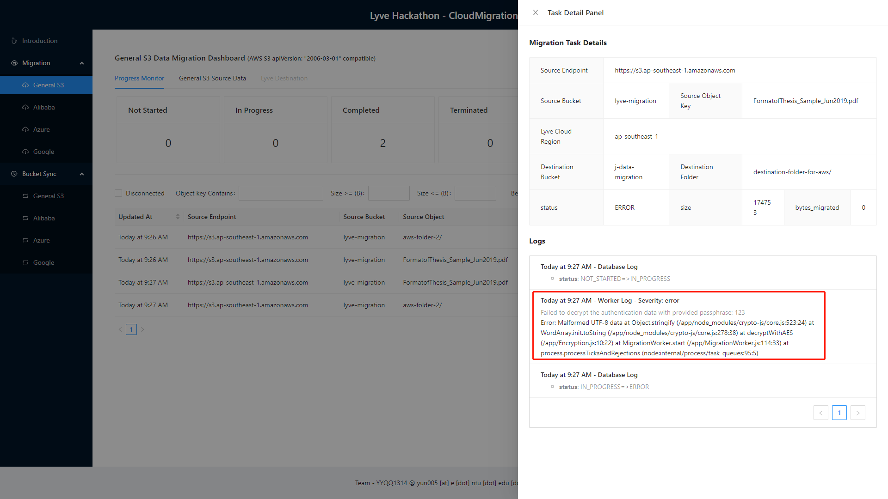
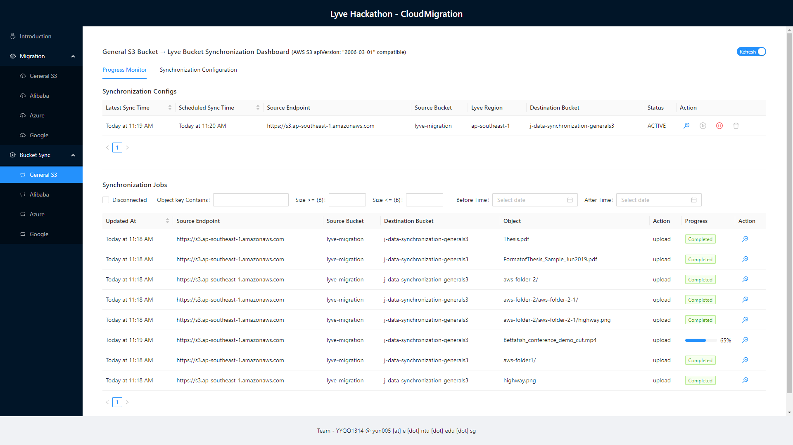
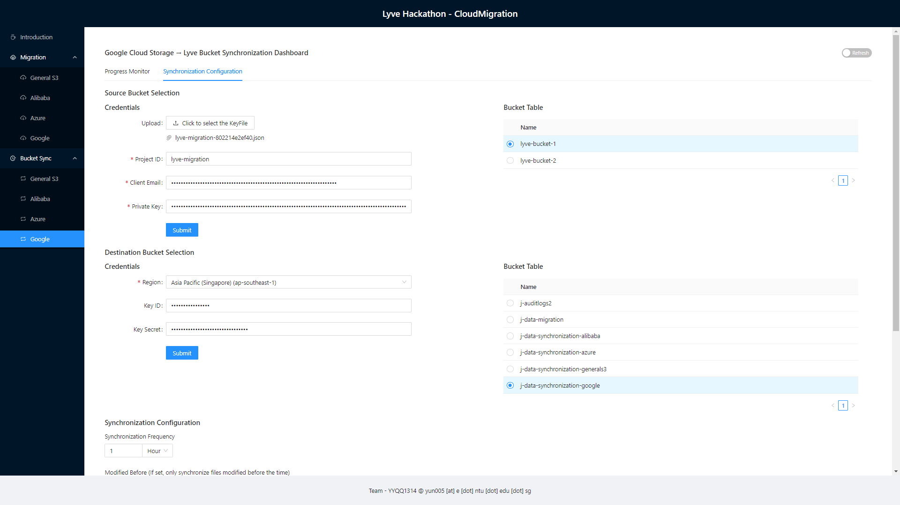
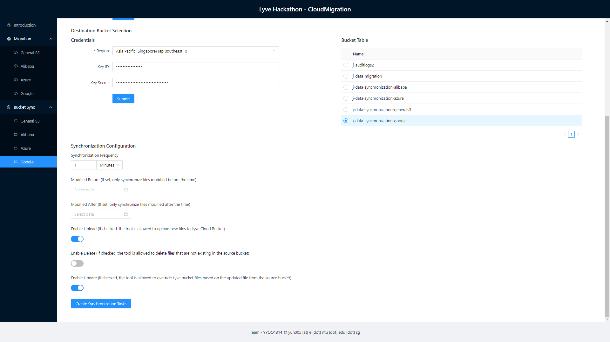

# Cloud Migration Project

[Video Link](https://www.youtube.com/watch?v=k_-nLFwmF9I)

## Introduction

This is a full-stack solution for easily migrating files from other cloud services to Lyve cloud S3.

Users can submit **one-time migration tasks** to Lyve Cloud from various cloud providers such as Lyve Cloud, AWS S3,
Alibaba OSS, Google Cloud Storage, and Azure Containers.

Users can also set up **continuous bucket synchronization tasks**, for automatically synchronizing buckets or containers
from other cloud providers to Lyve Cloud.

## Requirements

- Docker (20.10.14+)
- Docker-compose (1.29.2+)

## Known Limitations

- Data flow direction only from other cloud to Lyve
- Support General S3 (AWS, Lyve), Google Cloud Storage, Alibaba OSS, Azure Container currently.

## Key areas addressed by CloudMigration

* Security
    * Authentication keys and secrets are encrypted with user's provided passphrase and securely stored in database
      instead of plain text.
* Performance
    * Single step to run.
    * Live monitoring of migration/synchronization status.
* Resiliency
    * Exception handling after every network requests.
    * If the workers are shutdown accidentally, they will set the current task to proper state before exit.
* Scalability
    * Migration (and synchronization) process can be scaled easily without limit by starting multiple instances of
      migration (and synchronization) workers.
    * Migration and synchronization workers can be started on remote machines/servers.
* Recovery
    * Detailed migration/synchronization logs are saved in the Non-SQL database (MongoDB) and persisted using a docker
      volume.

## Potential improvements

- Support more cloud providers such as OneDrive or Google Drive.
- Support for website/email notification upon task error or completion

## One Step to Set Up

**Step:** Edit the `PASSPHRASE` and `BACKEND_IP` address in the `.env` file.

You will need to provide this passphrase when submitting the migration tasks in the website.
The migration workers will use this passphrase to decrypt the cloud authentication credentials.

The backend IP address needs to be set to the IP address of the computer where you run `docker-compose up`.

For example, if you start docker containers on computer A with IP `192.168.0.100`.
Then the backend IP address should be set to `192.168.0.100` in the `.env` file.

## One Step to Run

**Step:** Build and start all the services with `docker-compose` command.

    cd .../Lyve-Cloud-solutions-samples/hackathon-submissions/cloud-migration-yyqq1314/
    
    # for small quantity migration:
    docker-compose up --build 

**Note:**
For large quantity of migration tasks, you may use the following command to bring up multiple instances of workers:

    # for large quantity migration:
    docker-compose up --build --scale migration_worker=3 --scale synchronization_worker=3

## Results

Open Browser and go to `http://BACKEND_IP:3000` (e.g. http://192.168.0.103:3000) and follow instructions on the website
to submit migration tasks or
synchronization tasks.

Migration Dashboard


Select Objects for Migration


Select Destination for Migration


Check Migration Tasks Details


Migration task error details if any


Synchronization Task Dashboard


Create Synchronization Tasks - Bucket Pair


Create Synchronization Tasks - Configuration


### Project Structure

This section will describe the representation of each of the folders or files in the structure.

```
.
├── README.md
├── docker-compose.yml
├── code/
│   └── frontend/
│   └── backend/
│   └── migrationWorker/
│   └── synchronizationWorker/
├── documentation/
│   └── demo_video.mp4
│   └── introduction.pptx
└── images/
    └── xxx.png
```

### `code/`

This folder contains all the code.

#### `code/frontend/`

This is the frontend of CloudMigration developed with React and Ant Design framework.

#### `code/backend/`

This is the backend of CloudMigration developed with Express on Node.JS.

#### `code/migrationWorker/`

This is the folder of worker service performing one-time migration tasks developed in Node.JS.

#### `code/synchronizationWorker/`

This is the folder of worker service performing continuous synchronization jobs developed in Node.JS.

### `documentation/`

This folder contains the demo video and presentation file.

### `images/`

This folder contains all the images used in this `README.md`

## Tested by

* May 23, 2022: Tang Yun (yun005@e.ntu.edu.sg) on Windows 10. See [TESTS.md](TESTS.md) for details.