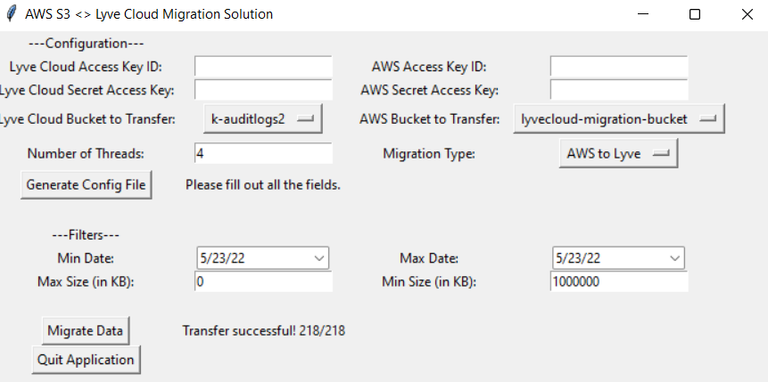

# AWS S3 <> Lyve Cloud Data Migration Solution

[Video Link](https://vimeo.com/712735327)

[Link to executable file](https://entuedu-my.sharepoint.com/:u:/g/personal/call0001_e_ntu_edu_sg/EXlyd1TRfb1Ctti9pcNkQjsBtdVeYufJkmOIaG9JwvmPgw?e=S0FNEH)

## Introduction

This integration solution provides a user-friendly GUI for the data migration of all types of data between AWS S3 <> Lyve Cloud. It aims to be easy to use, highly observable and strongly featured.

Features:

- Easy-to-use Tkinter GUI
- User can choose to migrate from AWS S3 to Lyve Cloud, or vice versa
- User can indicate filters by creation date and data size
- User can indicate number of threads used for multithreading in order to speedup downloads
- Robust rollback and error handling
- Observability during migration via logs on the GUI

## Requirements

- Python 3 and above is required.
- Lyve Cloud access and secret keys. These can be obtained from the Lyve Cloud Console by creating a new Service Account to be used by this solution.
- IAM user with AmazonS3FullAccess policy.

## Known Limitations

- This integration solution currently only supports AWS <> S3 integration.
- Credentials are kept in plaintext.
- This example requires full access permissions to AWS S3.

## Running Steps

### Step 1: Get your Lyve Cloud bucket credentials.

Here's what you'll need:

- Access Key
- Secret key
- Endpoint URL

### Step 2: Generate AWS keys

1. Login to AWS and go over to [IAM](https://console.aws.amazon.com/iamv2/home).
2. Click on the "Users" tab.
3. Click "Add Users".
4. Enter any username you would like. Under the "Select AWS access type" select "Access key - Programmatic access".
5. In the permissions page, select "Attach existing policies directly".
6. Search for "AmazonS3FullAccess" and select it. **Warning: this policy will provide access to all S3 buckets.**.
7. Click "Next: Tags".
8. Click "Next: Review".
9. Click "Create user".
10. Your keys are now generated, copy the "Access Key ID" and "Secret access key".

### Step 3: Set up your environment

**Set up:**

1. Install all required packages: `pip3 install -r requirements.txt`.
2. Run `python3 engine.py` to pull up the GUI.

**Set up using executable:**

1. Download executable [here](https://entuedu-my.sharepoint.com/:u:/g/personal/call0001_e_ntu_edu_sg/EXlyd1TRfb1Ctti9pcNkQjsBtdVeYufJkmOIaG9JwvmPgw?e=S0FNEH)
2. Double click the executable to pull up the GUI.

**After getting the GUI running:**

1. Fill in `Lyve Cloud Access Key ID`, `Lyve Cloud Secret Access Key`, `AWS Access Key ID` and `AWS Secret Access Key` with your credentials.
2. Click `Generate Config File` - now, the dropdown for buckets should be populated.
3. Choose `Lyve Cloud Bucket to Transfer` or `AWS Bucket to Transfer`.
4. Change the number of threads (int), and indicate migration type (AWS to Lyve or vice versa).
5. Click `Generate Config File` again.
6. If necessary, include the filters for `Min Date`, `Max Date`, `Min Size` and `Max Size`.
7. Click `Migrate Data` and wait for the data to migrate.

## Results



## Tested by:

- Callista Chang (changcallista@gmail.com)

### Project Structure

This section will describe the representation of each of the folders or files in the structure.

```
.
|-images
  |-gui-initial.png
|-README.md
|-engine.py
|-requirements.txt
|-engine.exe
```

The main logic is present in the `engine.py` file. In the future, the functions will be decoupled for easier readability and extensibility. The link to the executable file is [here](https://entuedu-my.sharepoint.com/:u:/g/personal/call0001_e_ntu_edu_sg/EXlyd1TRfb1Ctti9pcNkQjsBtdVeYufJkmOIaG9JwvmPgw?e=S0FNEH), `engine.exe` is an executable created based on `engine.py` using `pyinstaller`.

### `/images`

This folder contains images shown on this `README`.
